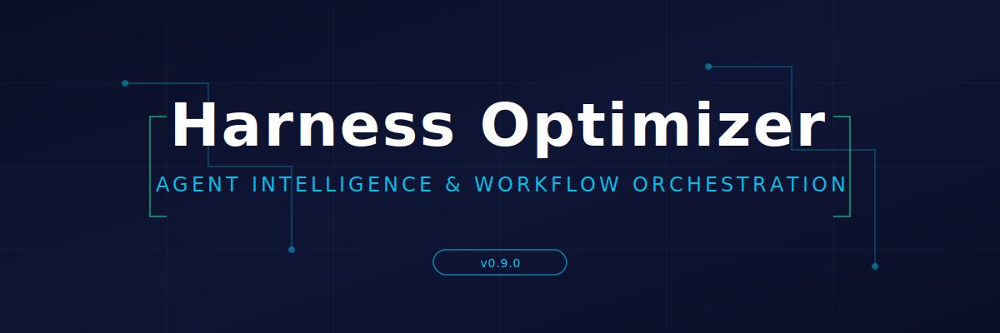

<p align="center">
  
</p>

<h1 align="center">Harness Optimizer</h1>

<p align="center">
  <strong>Analysis, hygiene, and workflow orchestration for agent environments.</strong>
</p>

<p align="center">
  <a href="#commands">Commands</a> ·
  <a href="#architecture">Architecture</a> ·
  <a href="#tests">Tests</a> ·
  <a href="#documentation">Docs</a> ·
  <a href="#license">License</a>
</p>

---

Current release: **v0.9.2**

Harness Optimizer reads agent config, sessions, logs, and runtime health surfaces. Detects what is actually wrong, ranks it, and reports it. Also provides a plan-then-execute workflow system (`/todo` + `/devdo`) for multi-agent development orchestration.

## What it does

**Performance Intelligence Suite:**
- `token-report` / `token-check` — track token usage, detect waste (bloat, retries, tool loops, overflow), optimize provider/model selection
- `perf-report` / `perf-check` — monitor AI API response times, error rates, retry rates, detect provider outages
- `tool-report` / `tool-check` — detect manual workarounds, encourage proper tool usage via MCP/gateway/inline tools
- `port-reserve` / `port-list` / `port-release` — reserve ports, forbid 3000/8080 forever, prevent conflicts
- `ip-list` / `ip-add` / `network-scan` — manage local IPv4 addresses, ban localhost/127.0.0.1, auto-detect network IPs

**Analysis and hygiene:**
- discovers agent config, sessions, logs, databases, and runtime surfaces
- detects failures, auth errors, timeouts, crashes, and config drift
- validates provider endpoints and model names against live truth
- detects stale, deprecated, and misconfigured models
- diagnoses routing failures and broken fallback chains
- checks gateway health, CLI health, and provider registry integrity
- removes blank providers, collapses duplicates, strips stale embedded credentials

**Workflow orchestration:**
- `/todo` creates and freezes execution plans
- `/devdo` runs plans through parallel subagent batches
- task DAGs with dependency resolution and role pools
- two-stage review, checkpoint/resume, blocker routing
- scales to 10+ concurrent subagents

**Budget tuning:**
- `budget-review` analyzes session utilization and recommends profiles
- `budget-set` applies turn-budget profiles with dry-run safety
- five-step sliding scale (low → high) with per-role overrides
- passive `budget-watch` monitor for post-session advice

**Reports:**
- grouped findings with plain-language recommendations
- JSON and Markdown export
- inspected-inputs visibility and live health checks

## Quick start

```
pip install -e .
hermesoptimizer --help
PYTHONPATH=src python -m hermesoptimizer --help   # src-layout repo-root check
```

## Commands

| Command | Purpose |
|---------|---------|
| `hermesoptimizer run` | Discover Hermes surfaces, analyze them, store findings, and emit JSON/Markdown reports |
| `hermesoptimizer export` | Write JSON and Markdown reports from the catalog |
| `hermesoptimizer init-db` | Initialize the SQLite catalog |
| `hermesoptimizer add-record` / `add-finding` | Insert catalog fixtures or manual records/findings |
| `hermesoptimizer list-records` / `list-findings` | Inspect catalog contents |
| `hermesoptimizer db-vacuum` | Reclaim SQLite DB space |
| `hermesoptimizer db-retention --days N` | Prune old catalog data |
| `hermesoptimizer db-stats` | Show DB size and per-table row counts |
| `hermesoptimizer token-report` / `token-check` | Analyze token usage and detect waste |
| `hermesoptimizer perf-report` / `perf-check` | Analyze provider performance and quick-check configured providers |
| `hermesoptimizer tool-report` / `tool-check` | Analyze tool usage and detect manual workarounds |
| `hermesoptimizer port-reserve` / `port-list` / `port-release` | Manage reserved ports |
| `hermesoptimizer ip-list` / `ip-add` / `network-scan` | Manage IP inventory and scan local IPv4s |
| `hermesoptimizer budget-review` / `budget-set` | Review and apply turn-budget profiles |
| `hermesoptimizer vault-audit` / `vault-writeback` | Audit vault state and execute confirmed write-back |
| `hermesoptimizer todo` / `devdo` / `dodev` | Plan and execute workflow runs |
| `hermesoptimizer caveman` | Toggle caveman mode |
| `hermesoptimizer ext-list` | List registered extensions |
| `hermesoptimizer ext-status` | Show extension source vs runtime status |
| `hermesoptimizer ext-verify` | Run verification for one or all extensions |
| `hermesoptimizer ext-sync` | Sync repo-managed artifacts to install targets |
| `hermesoptimizer ext-doctor` | Run extension health check with drift detection |
| `hermesoptimizer provider-list` | List available providers |
| `hermesoptimizer provider-recommend` | Rank provider/model recommendations from checked-in catalogs and local truth |
| `hermesoptimizer workflow-list` | List workflow plans and runs |
| `hermesoptimizer dreams-inspect` | Inspect dreams sidecar state |
| `hermesoptimizer report-latest` | Print the newest report from the runtime report directory |
| `hermesoptimizer verify-endpoints` | Verify a provider endpoint/model against truth data |
| `hermesoptimizer dreams-sweep` | Run a read-only dreams memory sweep summary |
| `hermesoptimizer release-readiness` | Run closeout gate: install integrity, model truth, channel status |
| `hermesoptimizer config-status` | Show current model/provider, last backup, diff since backup |
| `hermesoptimizer auxiliary-status` | Show auxiliary role routing, constraint pass/fail, evaluator recommendations |
| `hermesoptimizer auxiliary-recommend` | Rank optimal auxiliary model assignments from catalog |
| `hermesoptimizer yolo-status` | Show YOLO mode state, blocklist count, auto-approve status |
| `hermesoptimizer service start/stop/status/flush` | Config watcher daemon lifecycle and flag management |

## Architecture

The project follows a src-layout with a unified CLI entrypoint.
Extension surfaces (caveman, dreams, vault plugins, tool-surface commands, scripts, skills, cron) are registered as first-class extensions under `extensions/` and managed through `ext-*` commands.

```
src/hermesoptimizer/
  __main__.py             unified CLI entrypoint
  cli/                    unified argparse surface and command dispatch
    __init__.py           build_parser(), dispatch()
    legacy.py             init-db/add-record/export/list/vault/budget handlers
    v091.py               token/perf/tool/network handlers
    run.py                unified run pipeline
    workflow.py           todo/devdo/dodev/caveman handlers
    orphan.py             provider/verify/dreams/report closeout handlers
  run_standalone.py       backward-compatible shim to unified CLI
  discovery.py            Hermes surface discovery
  loop.py                 discover → diagnose → report loop
  catalog.py              SQLite schema and CRUD
  budget/                 turn-budget tuning sidecar
  tokens/                 token usage tracking and optimization
  perf/                   provider performance monitoring
  tools/                  tool usage optimization
  network/                port and IP discipline
  tool_surface/           read-only command layer and recommender surfaces
  verify/                 endpoint verification and config-fix helpers
  dreams/                 dreaming/memory sidecar
  vault/                  vault audit, validation, write-back, plugins
  workflow/               /todo and /devdo workflow engine
  report/                 JSON, Markdown, metrics, and issues
  sources/                Hermes/runtime/provider source readers
```

## Tests

`PYTHONPATH=src pytest --collect-only` currently reports 1,626 collected tests.

Run the full suite with:

```
PYTHONPATH=src python -m pytest -q
```

## Documentation

- `ARCHITECTURE.md` — system shape, data flow, design constraints
- `GUIDELINE.md` — success rules and release gates
- `ROADMAP.md` — release sequence
- `TESTPLAN.md` — canonical layered test matrix, selectors, and release gates
- `CHANGELOG.md` — version history
- `docs/WORKFLOW.md` — operator guide for /todo and /devdo
- `TODO.md` — current execution queue

## What this is not

- not a generic catalog scraper
- not a multi-harness rewrite
- not a place to silently mutate config
- not a system that calls a session healthy when the runtime evidence says otherwise

## License

Apache License 2.0 with Non-Commercial Clause.

This software is licensed under the Apache License, Version 2.0, with the additional restriction that it may not be used for commercial purposes without explicit written permission. See [LICENSE](LICENSE) for full terms.
